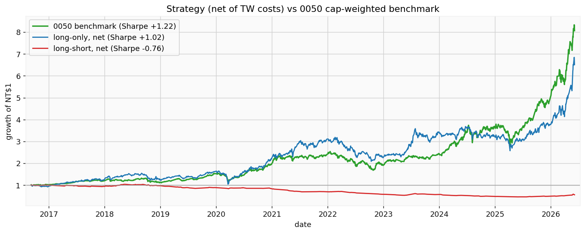
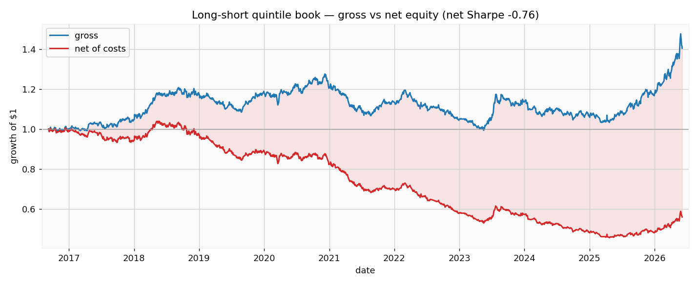
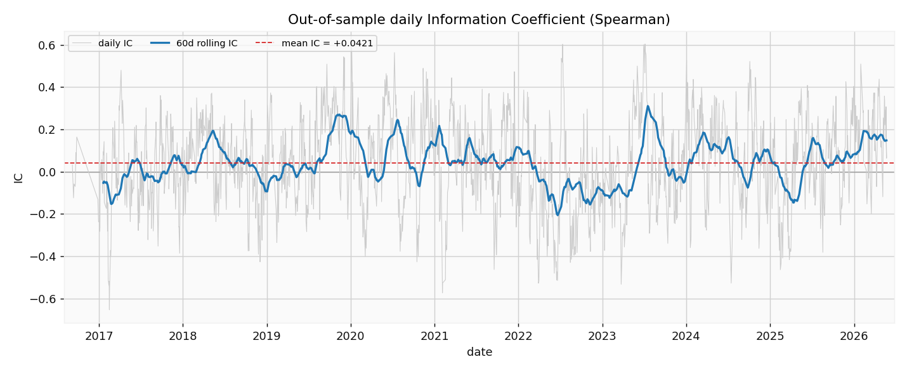
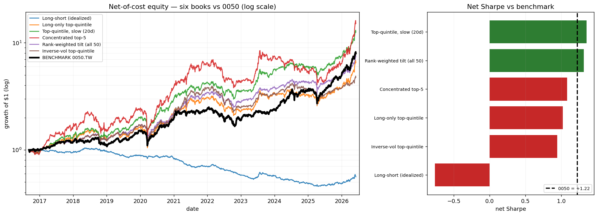
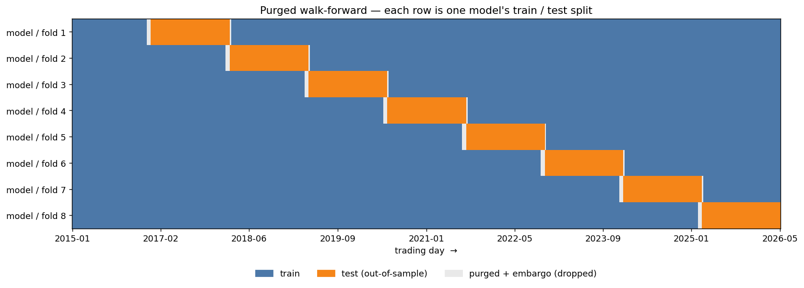
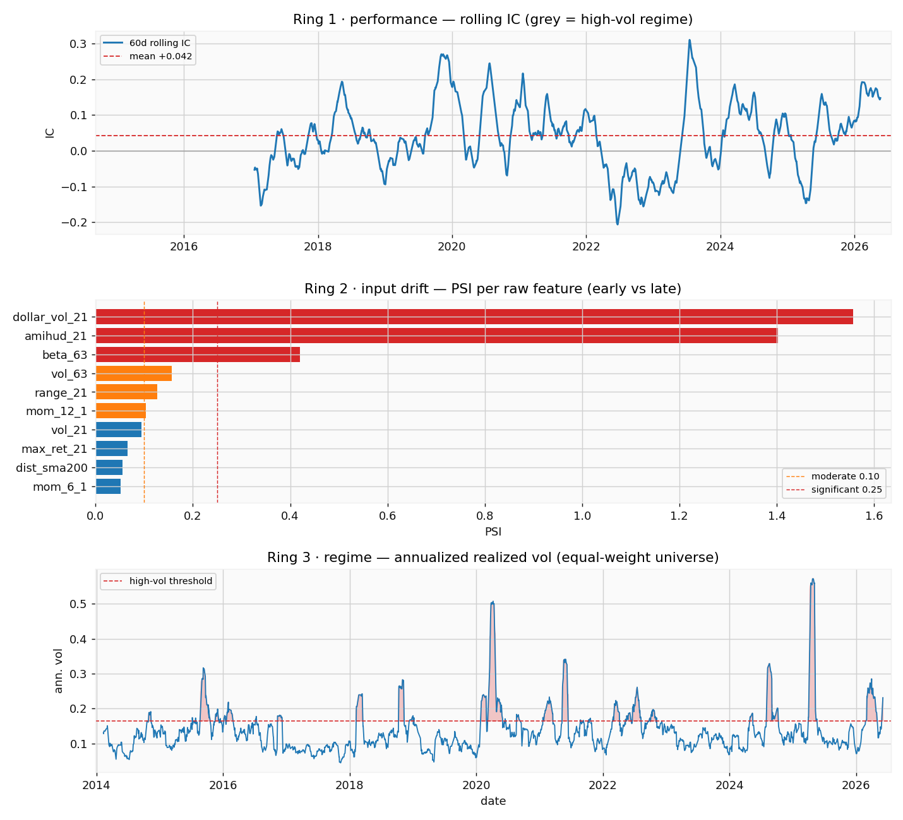

# quant-demo — LightGBM cross-sectional long-short on the TWSE top-50

A self-contained, laptop-scale ML quant research loop on the **TWSE top-50**
universe. A LightGBM model learns ~18 point-in-time features and ranks the
cross-section daily; a **dollar-neutral, quintile long-short** book trades the
top vs. bottom names. The point is *methodological honesty* — purged
walk-forward validation, cross-sectional normalization, real Taiwan transaction
costs, and drift monitoring — not a deployable edge.

**The honest headline: in a roaring TWSE bull market, the long-short book loses
to the index by a mile and makes no money after fees. The cross-sectional /
sector dispersion simply isn't strong or persistent enough to overcome cost.**

---

## TL;DR — what actually happened

Out-of-sample **2016-09 → 2026-05** (2,292 trading days, 112k predictions):

| Book | Sharpe (gross) | Sharpe (net) | Ann. return | Vol | Max DD | Turnover/rebal |
| --- | ---: | ---: | ---: | ---: | ---: | ---: |
| **Long-short** (idealized) | 0.52 | **−0.76** | −5.9% | 7.7% | −56.3% | 68.5% |
| **Long-only** top-quintile (deployable) | 1.47 | 1.02 | +22.4% | 21.9% | −36.7% | 68.7% |
| **0050.TW** benchmark (buy & hold) | — | **1.22** | +24.2% | 19.8% | −33.8% | 0% |

Three findings, in plain terms:

1. **The market was a freight train.** 0050 (the cap-weighted top-50 ETF) compounded
   NT$1 → ~NT$8 and returned **+24%/yr** at a Sharpe of 1.22. Beating buy-and-hold
   in this regime was always going to be hard.
2. **The long-short book loses money after costs.** Its *gross* signal is faintly
   positive (Sharpe 0.52), but **net Sharpe is −0.76** — the entire thin edge is
   eaten by ~10%/yr in turnover cost. A long/short, dollar-neutral construction
   strips out the bull-market beta that was the only thing paying, and the residual
   cross-sectional spread isn't big enough to cover the fee stack.
3. **Even long-only doesn't beat the index.** The realistic, shortable variant
   (long the top quintile, net of costs) lands at **Sharpe 1.02 vs. 0050's 1.22** —
   close, but it does *not* clear the bar. The honest deliverable here is the
   rigorous loop, not alpha.

> **Interpretation for the interview:** the gross-vs-net gap *is* the result. It
> says the signal is real-but-thin (positive IC, positive gross long-short) and
> that **sector/cross-sectional dispersion across the TWSE top-50 is too weak to
> monetize a dollar-neutral book after Taiwan costs.** The fix is structural —
> longer holds / signal smoothing / a less concentrated universe — not a fancier
> model.

---

## The cost story (why long-short dies)

Gross, the long-short book drifts mildly upward (ends ~1.45×). Net of the real TW
retail cost stack it bleeds steadily to ~0.55×. The shaded gap is pure
transaction cost on **~69% turnover per rebalance**. This is the single most
important chart in the repo: a positive gross signal that is structurally
unprofitable once you charge it honestly.

## The signal is real but small

| Metric | Value | Sanity band |
| --- | ---: | --- |
| Mean daily IC (Spearman) | **+0.0421** | 0.01–0.04 |
| ICIR (overlap-adjusted) | **+1.00** | 0.5–2.0 |
| ICIR (naive √252) | +3.16 | *(inflated — see note)* |
| IC t-stat | +9.52 | — |
| IC hit rate | 58.3% | — |

The IC is small, positive, and statistically distinguishable from zero, but it
swings sign across regimes (the 60-day rolling line spends real time underwater).
*Note on annualization:* the naive `√252` ICIR reads 3.16, but daily ICs share
9/10 of their 10-day label window (lag-1 autocorr ≈ 0.85), so we annualize over
*effective* independent periods — the honest ICIR is ~**1.0**, not 3.

## Does any construction work?

Sweeping seven portfolio constructions off the *same* predictions: the long-biased
books (rank-weighted tilt, slow top-quintile) ride the bull and roughly track 0050;
the **market-neutral long-short sits dead last**. No construction beats simple
buy-and-hold net of costs. Honest, and exactly what you'd expect when the only
thing paying is beta and you've deliberately hedged it out.

---

## Methodology (the actual deliverable)

**Purged + embargoed walk-forward validation** — 8 expanding folds, with a
purge+embargo gap between train and test so the 10-day forward label can't leak
across the boundary:

**Three-ring drift monitor** — rolling-IC performance decay, PSI/KS input drift
per feature, and a realized-vol regime flag (plus an Evidently
[`reports/drift.html`](reports/drift.html)):

Other rigor baked in: features are **cross-sectionally z-scored each day** (rank
within the cross-section, not over time), predictions are **sector-neutralized**
before ranking (TSMC + the semis dominate TWSE cap), a **per-name 10% cap**
guards against single-name concentration, and everything is seeded
(`config.SEED`) and immutably cached so every number reproduces.

### Transaction costs (Taiwan, modeled explicitly)

Not a single fudge factor (`config.py`): broker fee **0.1425% on both buy and
sell** with an **NT$20-per-execution minimum**, plus a **0.30% securities
transaction tax on sells**. The NT$20 minimum only bites relative to trade size,
so the engine assumes an account NAV (`CAPITAL_TWD`, default **NT$100M**) to turn
weight changes into NT$ trade values.

---

## Pipeline

| Stage | Module | Output |
| --- | --- | --- |
| 1 Data | `data/ingest.py` | adjusted OHLCV parquet, common calendar (49 names, 2014→2026) |
| 2 Features | `features/alpha.py` | ~18 point-in-time features, cross-sectionally z-scored daily |
| 3 Model | `model/validation.py`, `model/train.py` | purged + embargoed walk-forward LightGBM, OOS predictions |
| 4 Metrics | `backtest/metrics.py` | mean IC, ICIR, t-stat, rolling-IC plot |
| 5–6 Backtest | `backtest/portfolio.py`, `backtest/engine.py` | dollar-neutral quintile long-short, vectorized engine, TW cost stack, gross-vs-net, vs 0050 |
| 7 Monitoring | `monitoring/drift.py` | three-ring drift + Evidently `reports/drift.html` |

## Run it

The end-to-end story lives in **[`run_pipeline.ipynb`](run_pipeline.ipynb)** —
run it top-to-bottom to reproduce every number and chart above
(`compare.ipynb` builds the seven-strategy sweep). Production logic lives in the
modules under `data/ … monitoring/`; each also runs standalone (e.g.
`uv run backtest/engine.py`) and prints its own acceptance checks. A scripted
entry point is kept in `run_pipeline.py`.

## Known limitations (named, not hidden)

- **Survivorship bias** — the universe is *today's* top-50 ranking, so names that
  dropped out are excluded, inflating historical returns. Production would use a
  point-in-time TWSE constituent history (e.g. TEJ).
- **Concentration** — TSMC + the semiconductor cluster dominate TWSE market cap,
  which is exactly why predictions are sector-neutralized before ranking.
- **Short availability** — borrowing some TWSE names is hard/expensive, so the
  long-short book is an idealization; long-only is the deployable variant.
- **Scope** — daily data only. The discipline (point-in-time features, purged
  validation, cost-aware backtest, drift monitoring) is identical at higher
  frequency; the horizon changes, the rigor doesn't.
