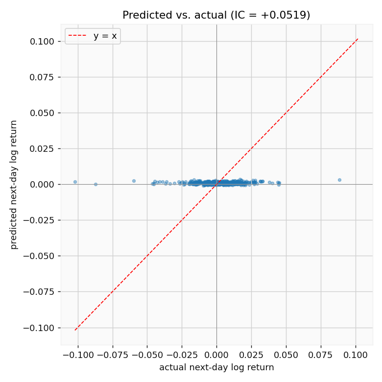
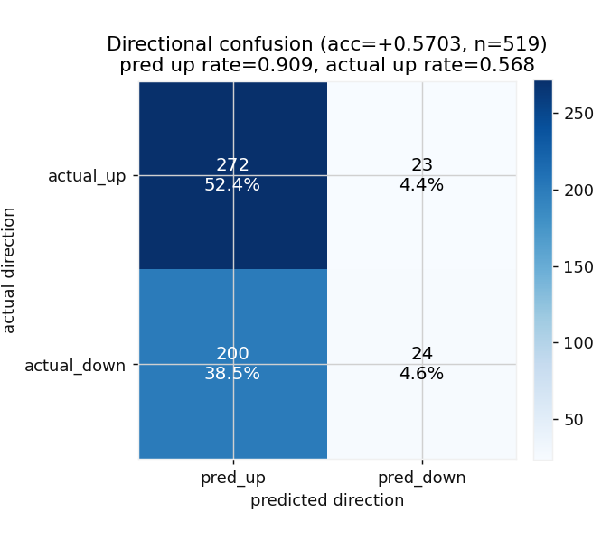
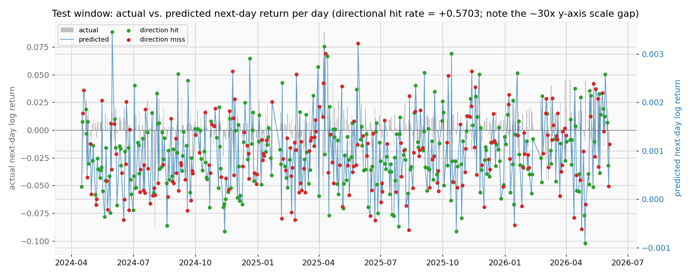
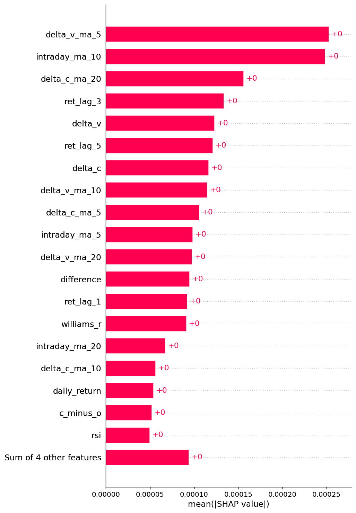

# TWII Next-Day Return Forecasting

A from-scratch reimplementation of the **CalixBoost** methodology: a single
**LightGBM** regressor that predicts the **next-day log return** of the Taiwan
Weighted Index (TAIEX, `^TWII`) from causal technical indicators. The deliverable is
_honest predictive power measured against naive baselines_ — not a trading book.

> **Honest scope.** Out-of-sample R² on daily returns is expected near zero or
> negative, and 51–54% directional accuracy is a _good_ result. A dramatically
> higher number on one split is leakage, not alpha. Every metric is reported next
> to a baseline so the numbers mean something.

## TL;DR — what this project found

**The model learns that the market drifts up a little almost every day, so it hedges
by making the same tiny "slightly up" prediction every single day.** It is, in
effect, a constant predictor. That is the *correct* statistical response to a
near-noise target — and the headline finding of the project.

On the most recent test split (n = 519 days, 2024-04 → 2026-06):

| metric | model | best baseline | reading |
|---|---|---|---|
| **MAE** | 1.088e-2 | 1.099e-2 (persistence, r̂=0) | barely beats "predict zero" |
| **Directional accuracy** | 57.0% | 56.8% (always-up) | basically ties the up-drift |
| **Information Coefficient** | +0.052 | 0 | a small, real edge |
| **Out-of-sample R²** | +0.001 | 0 | ≈ 0, exactly as expected |

The MAE/DirAcc edge over the baselines is real but *tiny*. There is no free alpha in
daily index returns — and the honesty of that result is the point.

### Why the model "keeps making the same guess"

The next-day return is almost pure noise (σ ≈ 1.6e-2) with a faint positive drift.
Under MAE/L1 loss with early stopping and L1/L2 regularization, the loss-minimizing
move is to **shrink every prediction toward the conditional median** — a small
positive constant — because inflating predictions to the true ±2.5e-2 scale would
only *worsen* MAE on a target it cannot actually forecast. So predictions collapse
to a flat band of ≈ +8e-4, about **30× smaller** than the actual returns.



> The cloud of predictions is a **horizontal line near zero** — actuals span ±0.10,
> predictions barely leave +0.0005. The model is not tracking the market; it is
> emitting its best constant. IC is +0.05 only because that constant leans the
> correct (up) way.

Because the constant is positive, the model calls **"up" on 91% of days** while the
market was actually up on 57% of them. Its directional "wins" come almost entirely
from the up-biased test window, not from genuine timing — note the near-empty
`pred_down` column:



Per day, the predicted series (right axis, ~30× magnified to even be visible) is a
flat ripple against the real volatility (left axis); green = direction hit, red =
miss:



### What the model *does* key on

TreeSHAP ranks the **stationary return / volume-change / oscillator** family at the
top (`delta_v_ma_5`, `intraday_ma_10`, `delta_c_ma_20`, return lags, `williams_r`,
`rsi`). The non-stationary price-level block (raw MAs, EMAs, Bollinger bands, MACD)
never appears — it was discarded *before* training by the temporal-consistency
filter described below. All SHAP magnitudes are ~1e-4, consistent with a model that
moves its output very little.



### Interview takeaway

The pipeline is built to **expose** this result, not hide it: every metric sits next
to a baseline, scoring is per next-day prediction (never a compounded price level
that would manufacture a flattering equity curve), and a leakage test gates the whole
thing. The "boring" constant-predictor outcome is the honest answer to "can technical
indicators forecast tomorrow's TAIEX return?" — *barely, and only on average.*

## Layout

```
src/twii_forecast/
  config.py    constants: windows, split ratios, paths, seed
  data.py      yfinance pull + volume data-quality gate
  features.py  causal/trailing technical indicators
  target.py    next-day log return  r_{t+1} = ln(C_{t+1}/C_t)
  dataset.py   assemble X/y, drop warmup + tail NaNs
  split.py     chronological 85/5/10
  feature_selection.py  temporal consistency analysis (trimonthly AUC)
  scaling.py   RobustScaler (IQR), fit on TRAIN only
  model.py     LightGBM + early stopping + random search
  evaluate.py  MAE / RMSE / DirAcc / IC / R² vs. baselines
  monitor.py   evidently train-vs-test drift report
  plots.py     candles, pred-vs-actual, residuals, next-day directional accuracy
notebooks/run_pipeline.ipynb   thin end-to-end orchestration
tests/test_leakage.py            correctness gate (no future bleed)
tests/test_feature_selection.py  temporal consistency analysis behaviour
```

## Run

```bash
uv sync
uv run pytest                        # leakage gate — must pass
uv run jupyter lab notebooks/run_pipeline.ipynb
```

## The two non-negotiable correctness gates

1. **`tests/test_leakage.py` passes** — every rolling op is trailing; the target is
   strictly future (`ln(C_{t+1}/C_t)`); features are provably causal (truncating the
   series at _t_ does not change the feature row at _t_).
2. **Every metric is reported next to its baseline** — _persistence_ (`r̂ = 0`) and
   _historical mean_ (`r̂ = mean(r_train)`).

## Feature selection: temporal consistency analysis (CalixBoost §3.2.3.2)

Before training, `feature_selection.py` weeds out **temporally inconsistent** columns —
features whose *distribution drifts across time*, because a model trained on the past
won't generalise on a non-stationary column. The training series is split into
consecutive 3-month (_trimonthly_) periods; ~20 business days a month is too few for a
monthly split to be significant. For every **non-overlapping pair** of periods, each
feature is scored by how well it alone separates one period from the other —
`sklearn.metrics.roc_auc_score`, taken as `max(AUC, 1 − AUC)` so the direction of
separation doesn't matter. Reading is inverted from the usual convention: **AUC ≈ 0.5
is the *good* outcome** — the periods are indistinguishable, so the feature is stable and
is **kept**; an AUC driven toward 1 means the feature alone tells the periods apart
(drift), so it is **dropped**. The pairwise AUCs are averaged per feature and thresholded
at **τ = 0.7** (the paper treats 0.7–0.9 as "strong separation"). On the current pull
this keeps 23 of 36 features and drops the non-stationary price-level block (the MAs,
EMAs, Bollinger bands and MACD that trend with the index). The analysis runs on **train
only** (selecting on val/test would leak), the surviving subset flows into scaling,
training and evaluation, and the full per-feature AUC table is written to
`reports/temporal_consistency.csv`. A whole-distribution `evidently` train-vs-test drift
report (`monitor.py`) is written alongside it as `reports/drift_report.html`.

## Notes on the data

- `^TWII` has **no real Adjusted Close** (an index has no dividend reinvestment), so
  `AdjClose := Close` and the duplicate AC-based indicators are dropped.
- Yahoo's index volume can be degenerate; `data.validate_volume` gates it at runtime
  (<5% zero/NaN to keep volume features). With the current pull it passes.

## Reference

- [CalixBoost](https://aircconline.com/csit/papers/vol12/csit121009.pdf)
- [Shapley Additive Explanations (SHAP)](https://www.youtube.com/watch?v=VB9uV-x0gtg)
- [A Unified Approach to Interpreting Model Predictions](https://arxiv.org/pdf/1705.07874)
